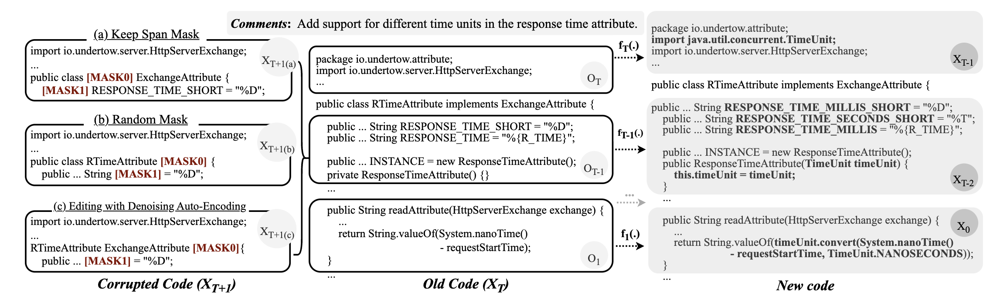

# 📢 News

- We open-source all data processing and training code for DivoT5.


# DivoT5
We propose a directional diffusion technique at the data level of code evolution and apply it within an Encoder-Decoder framework.

The directional diffusion can be mainly divided into the following two steps:
- Noising process at the data level.
    - Seting the starting point to old code.
    - Adding artificial noise to perturb the old data.
    - Exploring the intermediate step in the real evolution process.
- Denoising process within the Encoder-Decoder framework.
    - Using the auto-regressive nature of the Encoder-Decoder framework.
    - Perceiving the specific evolutionary direction in generation.

## Overview & Example

> Figure 1: The directional diffusion process iteratively denoises and evolves the old code into new code.

This Figure 1 illustrates the schematic of directional diffusion, we set the starting point(i.e., $X_T$ in Figure 1) of the directional diffusion strategy as the old code.
We utilize intermediate data(i.e., $X_t$ in Figure 1) from the incremental evolution process to train the DivoT5 model, providing a clear directional and more detailed guidance information to reinforce the evolutionary direction.
In Figure 1, $X_{T+1}$ to $X_{T}$ represents the process of removing artificial noise(denoising), and $X_t$ to $X_{t-1}$ represents a step in code evolution. 


> Figure 2: An denoising example used in the DivoT5’s training process.

As shown in the code evolution example in Figure 2, 
modifying the old code to meet this requirement may involve changes in multiple locations, which could be far apart. Completing this evolution requires incremental modifications to all relevant locations.

# Open Source Code
💡 We open-source all data processing and training code for DivoT5.

You can preprocess the pretraining data in the `data_preprocess` folder, find the code for pretraining DivoT5 in the `pretraining` folder, locate the code for fine-tuning DivoT5 in the `finetuning` folder, and explore usage examples for DivoT5 in the `inference` folder.


## Datasets & Models
### Datasets & Fine-tuned Models

You can download the datasets and models with fine-tuned weights from [this link](https://zenodo.org/records/11520642).


### An example of inference on the CodeReview dataset

Loading the model weigths.

```python
import torch
from models import build_or_load_gen_model
import argparse

parser = argparse.ArgumentParser()
args = parser.parse_args(args=[]) 

args.model_type = 'codet5'
args.model_name_or_path = 'Salesforce/codet5-base'
args.tokenizer_name = 'Salesforce/codet5-base'
args.from_scratch = False
args.add_lang_ids = False
args.load_model_path = None
config, model, tokenizer = build_or_load_gen_model(args)
args.load = '../models/codereview.bin'
model.load_state_dict(torch.load(args.load, map_location="cpu"))
```

Encode the original input.

```python
model.to('cuda')
model.eval()
# get ids
input_code = 'public void close ( ) { sketch = null ; } <s> Could set `null` to the `values` field too'
inputs = tokenizer.encode_plus(input_code, max_length=512, padding='max_length', return_tensors='pt').to('cuda')
```

Decode the generation results.
```python
decode_ids = model.generate(inputs['input_ids'], attention_mask=inputs['attention_mask'], max_length=512, num_beams=10)
tokenizer.decode(decode_ids[0], skip_special_tokens=True, clean_up_tokenization_spaces=False)
# generation results: 'public void close ( ) { sketch = null ; values = null ; }'
```

You can find the original code file in `./fine-tuning/inference.ipynb`.

### Pre-trained Models

We will release DivoT5 after our paper is accepted.


## More generation examples in CodeReview dataset

### 1. add features to old code.

**case1: Could set `null` to the `values` field too**

```java
// ******** Data Sample ********
// Review Comment:  Could set `null` to the `values` field too
// Old Code:        
public void close ( ) { sketch = null ; }
// New Code:        
public void close ( ) { sketch = null ; values = null ; }
// ******** Prediction ********
// CodeT5:          
public void close ( ) { if ( sketch != null ) { sketch = null ; } values = null ; }
// CodeT5+:         
public void close ( ) { sketch = null ; }
// CoditT5:         
public void close ( ) { sketch = null ; }
// CodeReviewer:    
public void close ( ) { sketch . close ( ) ; }
// DivoT5:          
public void close ( ) { sketch = null ; values = null ; }
```

### 2. remove feature in old code

**case1: wouldn't you want the conditions check prior to assignments?**

```java
// ******** Data Sample ********
// Review Comment:  wouldn't you want the conditions check prior to assignments?
// Old Code:        
public AttributeValueSearch ( IAttributeType attributeType , String attributeValue ) { this . attributeType = attributeType ; this . attributeValue = attributeValue ; Conditions . checkNotNull ( attributeType , " attributeType " ) ; Conditions . checkNotNullOrEmpty ( attributeValue , " attributeValue " ) ; }
// New Code:        
public AttributeValueSearch ( IAttributeType attributeType , String attributeValue ) { Conditions . checkNotNull ( attributeType , " attributeType " ) ; Conditions . checkNotNullOrEmpty ( attributeValue , " attributeValue " ) ; this . attributeType = attributeType ; this . attributeValue = attributeValue ; }
// ******** Prediction ********
// CodeT5:          
public AttributeValueSearch ( IAttributeType attributeType , String attributeValue ) { this . attributeType = attributeType ; this . attributeValue = attributeValue ; Conditions . checkNotNull ( attributeType , " attributeType " ) ; Conditions . checkNotNullOrEmpty ( attributeValue , " attributeValue " ) ; }
// CodeT5+:         
public AttributeValueSearch ( IAttributeType attributeType , String attributeValue ) { this . attributeType = attributeType ; this . attributeValue = attributeValue ; }
// CoditT5:         
public AttributeValueSearch ( IAttributeType attributeType , String attributeValue ) { this . attributeType = attributeType ; this . attributeValue = attributeValue ; }
// CodeReviewer:    
public AttributeValueSearch ( IAttributeType attributeType , String attributeValue ) { this . attributeType = attributeType ; this . attributeValue = attributeValue ; }
// DivoT5:          
public AttributeValueSearch ( IAttributeType attributeType , String attributeValue ) { Conditions . checkNotNull ( attributeType , " attributeType " ) ; Conditions . checkNotNullOrEmpty ( attributeValue , " attributeValue " ) ; this . attributeType = attributeType ; this . attributeValue = attributeValue ; }
```

**case 2: `.map(ThrowingFunction.unchecked(p -> p))` unnecessary**

```java
// ******** Data Sample ********
// Review Comment:  `.map(ThrowingFunction.unchecked(p -> p))` unnecessary
// Old Code:        
private void close ( Path path ) throws IOException { Path directoryWhereGeneratedArtifactsWasPlaced = path . getParent ( ) ; try ( Stream < Path > s = Files . list ( directoryWhereGeneratedArtifactsWasPlaced ) ) { s . filter ( p -> ! Files . isDirectory ( p ) ) . map ( ThrowingFunction . unchecked ( p -> p ) ) . forEach ( ThrowingConsumer . unchecked ( Files :: delete ) ) ; } }
// New Code:        
private void close ( Path path ) throws IOException { Path directoryWhereGeneratedArtifactsWasPlaced = path . getParent ( ) ; try ( Stream < Path > s = Files . list ( directoryWhereGeneratedArtifactsWasPlaced ) ) { s . filter ( p -> ! Files . isDirectory ( p ) ) . forEach ( ThrowingConsumer . unchecked ( Files :: delete ) ) ; } }
// ******** Prediction ********
// CodeT5:          
private void close ( Path path ) throws IOException { Path directoryWhereGeneratedArtifactsWasPlaced = path . getParent ( ) ; try ( Stream < Path > s = Files . list ( directoryWhereGeneratedArtifactsWasPlaced ) ) { s . filter ( p -> ! Files . isDirectory ( p ) ) . map ( ThrowingFunction . unchecked ( p -> p ) ) . forEach ( ThrowingConsumer . unchecked ( Files :: delete ) ) ; } }
// CodeT5+:         
private void close ( Path path ) throws IOException { Path directoryWhereGeneratedArtifactsWasPlaced = path . getParent ( ) ; try ( Stream < Path > s = Files . list ( directoryWhereGeneratedArtifactsWasPlaced ) ) { s . filter ( p -> ! Files . isDirectory ( p ) ) . map ( ThrowingFunction . unchecked ( p -> p ) ) . forEach ( ThrowingConsumer . unchecked ( Files :: delete ) ) ; } }
// CoditT5:         
private void close ( Path path ) throws IOException { Path directoryWhereGeneratedArtifactsWasPlaced = path . getParent ( ) ; try ( Stream < Path > s = Files . list ( directoryWhereGeneratedArtifactsWasPlaced ) ) { s . filter ( p -> ! Files . isDirectory ( p ) ) . map ( ThrowingFunction . unchecked ( p -> p ) ) . forEach ( ThrowingConsumer . unchecked ( p -> p ) ) ; } }
// CodeReviewer:    
private void close ( Path path ) throws IOException { Path directoryWhereGeneratedArtifactsWasPlaced = path . getParent ( ) ; try ( Stream < Path > s = Files . list ( directoryWhereGeneratedArtifactsWasPlaced ) ) { s . filter ( p -> ! Files . isDirectory ( p ) ) . map ( ThrowingFunction . unchecked ( p -> p ) ) . forEach ( ThrowingConsumer . unchecked ( Files :: delete ) ) ; } }
// DivoT5:          
private void close ( Path path ) throws IOException { Path directoryWhereGeneratedArtifactsWasPlaced = path . getParent ( ) ; try ( Stream < Path > s = Files . list ( directoryWhereGeneratedArtifactsWasPlaced ) ) { s . filter ( p -> ! Files . isDirectory ( p ) ) . forEach ( ThrowingConsumer . unchecked ( Files :: delete ) ) ; } }
```

### 3. modify the implementation of the old code

**case1: shouldn't it be `> 1`**

```java
// ******** Data Sample ********
// Review Comment:  shouldn't it be `> 1`
// Old Code:        
public void testQueryCumulativeTable ( ) { computeActual ( " SELECT ▁ * ▁ FROM ▁ \ " * : * \ " " ) ; computeActual ( " SELECT ▁ * ▁ FROM ▁ \ " java . util . logging : * \ " " ) ; assertTrue ( computeActual ( " SELECT ▁ * ▁ FROM ▁ \ " java . lang : * \ " " ) . getRowCount ( ) > 0 ) ; assertTrue ( computeActual ( " SELECT ▁ * ▁ FROM ▁ \ " jAVA . LANg : * \ " " ) . getRowCount ( ) > 0 ) ; }
// New Code:        
public void testQueryCumulativeTable ( ) { computeActual ( " SELECT ▁ * ▁ FROM ▁ \ " * : * \ " " ) ; computeActual ( " SELECT ▁ * ▁ FROM ▁ \ " java . util . logging : * \ " " ) ; assertTrue ( computeActual ( " SELECT ▁ * ▁ FROM ▁ \ " java . lang : * \ " " ) . getRowCount ( ) > 1 ) ; assertTrue ( computeActual ( " SELECT ▁ * ▁ FROM ▁ \ " jAVA . LANg : * \ " " ) . getRowCount ( ) > 1 ) ; }
// ******** Prediction ********
// CodeT5:          
public void testQueryCumulativeTable ( ) { computeActual ( " SELECT ▁ * ▁ FROM ▁ \ " * : * \ " " ) ; computeActual ( " SELECT ▁ * ▁ FROM ▁ \ " java . util . logging : * \ " " ) ; assertTrue ( computeActual ( " SELECT ▁ * ▁ FROM ▁ \ " java . lang : * \ " " ) . getRowCount ( ) > 1 ) ; assertTrue ( computeActual ( " SELECT ▁ * ▁ FROM ▁ \ " jAVA . LANg : * \ " " ) . getRowCount ( ) > 0 ) ; }
// CodeT5+:         
public void testQueryCumulativeTable ( ) { computeActual ( " SELECT ▁ * ▁ FROM ▁ \ " * : * \ " " ) ; computeActual ( " SELECT ▁ * ▁ FROM ▁ \ " java . util . logging : * \ " " ) ; assertTrue ( computeActual ( " SELECT ▁ * ▁ FROM ▁ \ " java . lang : * \ " " ) . getRowCount ( ) > 1 ) ; assertTrue ( computeActual ( " SELECT ▁ * ▁ FROM ▁ \ " jAVA . LANg : * \ " " ) . getRowCount ( ) > 0 ) ; }
// CoditT5:         
public void testQueryCumulativeTable ( ) { computeActual ( " SELECT ▁ * ▁ FROM ▁ \ " * : * \ " " ) ; computeActual ( " SELECT ▁ * ▁ FROM ▁ \ " java . util . logging : * \ " " ) ; assertTrue ( computeActual ( " SELECT ▁ * ▁ FROM ▁ \ " java . lang : * \ " " ) . getRowCount ( ) > 1 ) ; assertTrue ( computeActual ( " SELECT ▁ * ▁ FROM ▁ \ " jAVA . LANg : * \ " " ) . getRowCount ( ) > 0 ) ; }
// CodeReviewer:    
public void testQueryCumulativeTable ( ) { computeActual ( " SELECT ▁ * ▁ FROM ▁ \ " * : * \ " " ) ; computeActual ( " SELECT ▁ * ▁ FROM ▁ \ " java . util . logging : * \ " " ) ; assertTrue ( computeActual ( " SELECT ▁ * ▁ FROM ▁ \ " java . lang : * \ " " ) . getRowCount ( ) > 1 ) ; assertTrue ( computeActual ( " SELECT ▁ * ▁ FROM ▁ \ " jAVA . LANg : * \ " " ) . getRowCount ( ) > 0 ) ; }
// DivoT5:          
public void testQueryCumulativeTable ( ) { computeActual ( " SELECT ▁ * ▁ FROM ▁ \ " * : * \ " " ) ; computeActual ( " SELECT ▁ * ▁ FROM ▁ \ " java . util . logging : * \ " " ) ; assertTrue ( computeActual ( " SELECT ▁ * ▁ FROM ▁ \ " java . lang : * \ " " ) . getRowCount ( ) > 1 ) ; assertTrue ( computeActual ( " SELECT ▁ * ▁ FROM ▁ \ " jAVA . LANg : * \ " " ) . getRowCount ( ) > 1 ) ; }
```

**case2: Statement can be rewritten inline.**

```java
// ******** Data Sample ********
// Review Comment:  Statement can be rewritten inline.
// Old Code:        
public boolean isExpired ( Date invocationDate ) { if ( getExpires ( ) != null ) { Date currentInvocationDate = invocationDate == null ? new Date ( ) : invocationDate ; return getExpires ( ) . before ( currentInvocationDate ) ; } return false ; }
// New Code:        
public boolean isExpired ( Date invocationDate ) { if ( getExpires ( ) != null ) { return getExpires ( ) . before ( invocationDate == null ? new Date ( ) : invocationDate ) ; } return false ; }
// ******** Prediction ********
// CodeT5:          
public boolean isExpired ( Date invocationDate ) { if ( getExpires ( ) != null ) { Date currentInvocationDate = invocationDate == null ? new Date ( ) : invocationDate ; return getExpires ( ) . before ( currentInvocationDate ) ; } return false ; }
// CodeT5+:         
public boolean isExpired ( Date invocationDate ) { if ( getExpires ( ) != null ) { Date currentInvocationDate = invocationDate == null ? new Date ( ) : invocationDate ; return getExpires ( ) . before ( currentInvocationDate ) ; } return false ; }
// CoditT5:         
public boolean isExpired ( Date invocationDate ) { if ( getExpires ( ) != null ) { Date currentInvocationDate = invocationDate == null ? new Date ( ) : invocationDate ; return getExpires ( ) . before ( currentInvocationDate ) ; } return false ; }
// CodeReviewer:    
public boolean isExpired ( Date invocationDate ) { if ( getExpires ( ) != null ) { Date currentInvocationDate = invocationDate == null ? new Date ( ) : invocationDate ; return getExpires ( ) . before ( currentInvocationDate ) ; } return false ; }
// DivoT5:          
public boolean isExpired ( Date invocationDate ) { if ( getExpires ( ) != null ) { return getExpires ( ) . before ( invocationDate == null ? new Date ( ) : invocationDate ) ; } return false ; }
```
